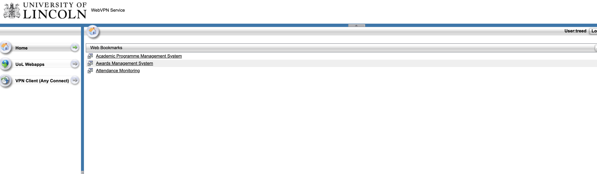
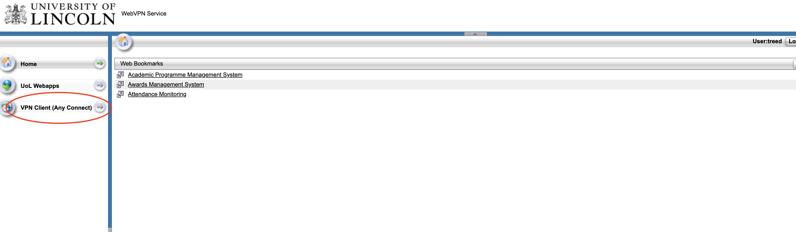
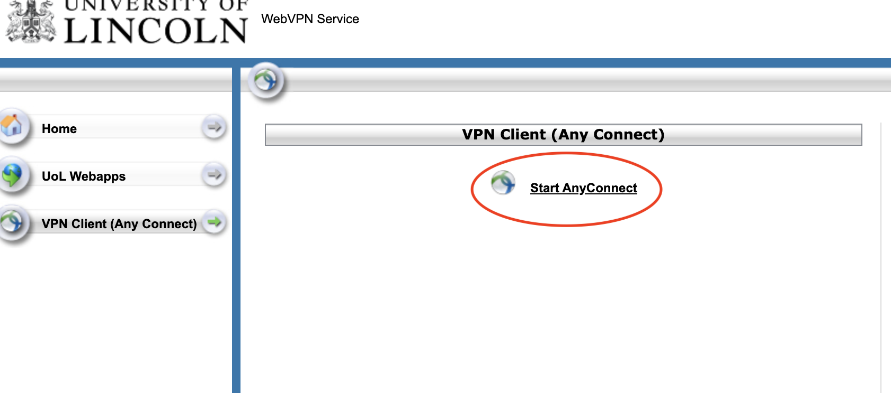

# VPN Setup
The university supplies a VPN solution for accessing the internal network from external sources (E.g. Your home!)

1. Go to http://remote.lincoln.ac.uk/

2. Enter your University username and password (e.g. your student account or staff account)
3. Click "continue"
4. On the left-hand side, click "VPN Client (Any Connect)"

5. Click "start AnyConnect"

6. Click the Download button

7. Run the installer
8. Open Cisco AnyConnect on your machine